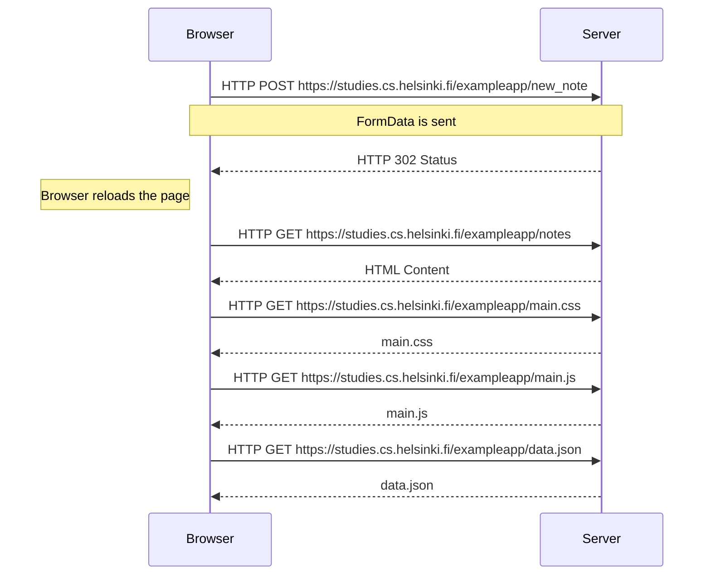

```mermaid
sequenceDiagram
Browser->>Server: HTTP POST https://studies.cs.helsinki.fi/exampleapp/new_note
Note over Browser, Server: FormData is sent
Server-->>Browser: HTTP 302 Status 
Note left of Browser: Browser reloads the page
Browser->>Server: HTTP GET https://studies.cs.helsinki.fi/exampleapp/notes
Server-->>Browser: HTML Content
Browser->>Server: HTTP GET https://studies.cs.helsinki.fi/exampleapp/main.css
Server-->>Browser: main.css
Browser->>Server: HTTP GET https://studies.cs.helsinki.fi/exampleapp/main.js
Server-->>Browser: main.js
Browser->>Server: HTTP GET https://studies.cs.helsinki.fi/exampleapp/data.json
Server-->>Browser: data.json
```
